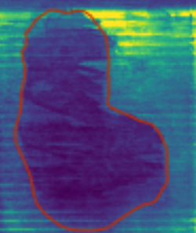
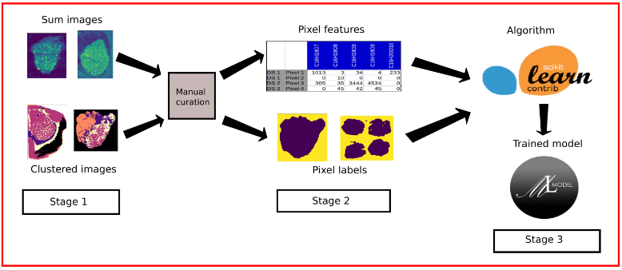

# Machine Learning Engineer Nanodegree
## Capstone Proposal
Vitaly Kovalev
April 19th, 2018

## Proposal

### Domain Background

Mass spectrometry is an analytical technique that ionizes chemical or biological material and measures mass-to-charge ratio (m/z) of the ions (mass spectrum). In simple terms, a mass spectrum measures distribution of masses in a sample. Knowing what masses usually correspond to what molecules makes it possible to use mass spectrometry for molecules detection in a sample.

Mass spectrometry Imaging (MSI) is a technique used in mass spectrometry to visualize the spatial distribution of masses in a sample. In MSI, a dataset can be represented as a 3-dimensional tensor (NxMxK). Where N and M are spatial dimensions (acquisition matrix) and K is a mass dimension (m/z bins). What is unusual about these images is that number of channels always exceeds spatial size of images. At the same time, the number of mass channels most of the time is excessive and can be reduced to a smaller number.

Pretty often during MSI acquisition, spectra are collected from the sample and nearby area. Also some instruments are restricted to rectangular acquisition areas only. This leads to a problem of separation of signals (spectra) coming from the sample itself from background signals coming primarily from nearby area.

European project METASPACE (http://metaspace2020.eu) aims to provide information about spatial distribution of small molecules of biological origin (metabolites) in samples provided by users in the form of MSI datasets. Implementation of a method for distinguishing between molecules coming from sample and background molecules could greatly improve quality of the molecular search provided by METASPACE.

### Problem Statement

The image above represents a “slice” of an MSI dataset for specific m/z. Inner part of manually outlined region is a sample area, the outside area is off sample (or background). Here we have an example of a signal that mostly comes (more intense signals are yellow) from the off sample area and thus not particularly interesting to the user.

The METASPACE project currently hosts more than 3000 MSI datasets. For a part of them, it is possible to define off sample areas using expert knowledge. This way, we can get the ground truth data for the problem in focus.

Each MSI dataset is represented by a 3 dimensional tensor NxMxK with mass measurements for each pixel, plus binary mask of NxM shape (each pixel assigned one of two classes). Using this data, it is possible to train a binary classification model that can be used to predict off sample masks (all pixels classes) for new MSI datasets.

Model performance can be measured the same way as in any other binary classification task, using accuracy, AUC, F1 or precision and recall scores.

### Datasets and Inputs

As the dataset of interest we are going to use an export from the METASPACE main database, two hundred high quality MSI datasets with sufficient number of detected molecules in them (as input data for models), binary masks defining off sample regions or classes for all pixels of a dataset (as labels for models).

The total number of molecules detected among all MSI datasets will define the depth (number of channels) of images to be used as model inputs. All images have different spatial resolution.

### Solution Statement

The proposed solution for the problem is to use the input data and labels to train pixel, region or image level classifiers in order to generalize knowledge about off sample molecular signals and use those knowledge to automatically define off sample regions in new MSI datasets.

Binary classification metrics like accuracy, AUC and F1 will be used for estimation of model quality.

### Benchmark Model

Different approaches for solving the off sample area separation problem were proposed in the following papers:
* “The Use of Random Projections for the Analysis of Mass Spectrometry Imaging Data” by Andrew D. Palmer
* “BASIS: High-performance bioinformatics platform for processing of large-scale mass spectrometry imaging data in chemically augmented histology” by Kirill Veselkov

The main limitation of these approaches is in the assumption of having some sort of knowledge about background signal and its spatial distribution for each MSI dataset. For example, molecules that can be associated with background signal coming from off sample region. Using this knowledge, it is possible to segment with high accuracy all pixels of an MSI dataset.

Taking approach that does not make any assumptions about molecular content or histology of a sample in MSI dataset would make it possible to train a general model capable of predicting off sample areas based on mass spectra and off sample masks as inputs only.

Given the requirement of having a general model that trains only on mass spectra data, as a benchmark model, we can use the simplest possible binary classifier, Logistic Regression trained on individual pixel vectors and labels without use of spatial information.

### Evaluation Metrics

A pair of standard for binary classification problem metrics is proposed for model evaluation:
* Area Under the ROC Curve (AUC)
* F1 score

Metrics will be calculated per pixel, so classes for each pixel will be evaluated independently.

### Project Design

The image above shows a theoretical workflow for approaching a solution given the problem. It consists of three stages:
1. Getting sum images (sum of all channels for each pixel) and clustered with k-means images.
2. Manual curation of the first stage results and preparation of input data and labels for the supervised model training.
3. Using a library for supervised learning to train a model given the outputs of the second stage.

At the third stage, we will have a model that will be capable of predicting off sample areas for completely new MSI datasets. Ideally, the model should be general enough so that it can provide confident and precise predictions even if the data was acquired using a different experimentation setup.

Supervised learning candidates: Logistic Regression, Random Forest, Naive Bayes, and Neural Networks.

Potential deviations from the above mentioned workflow are possible. E.g. use of Convolutional Neural Networks that will be taking whole images instead of just pixels as inputs.
